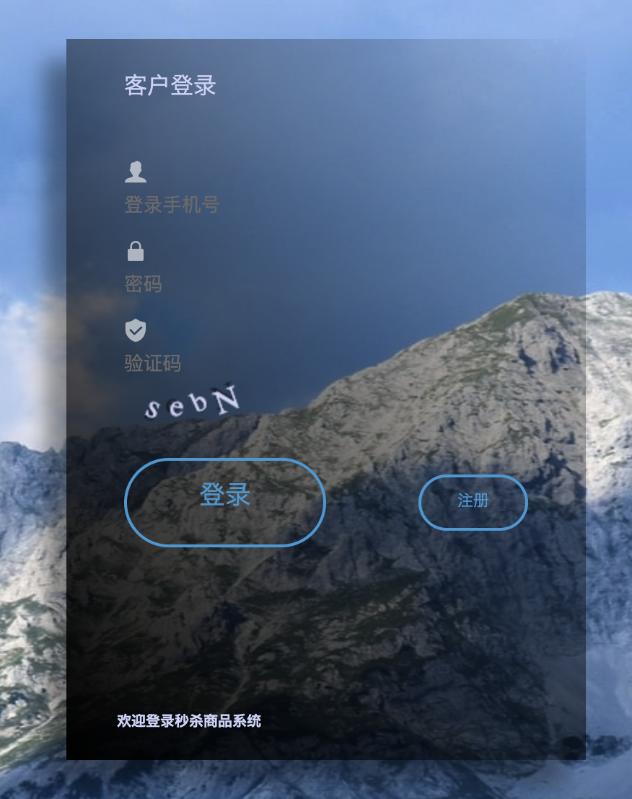
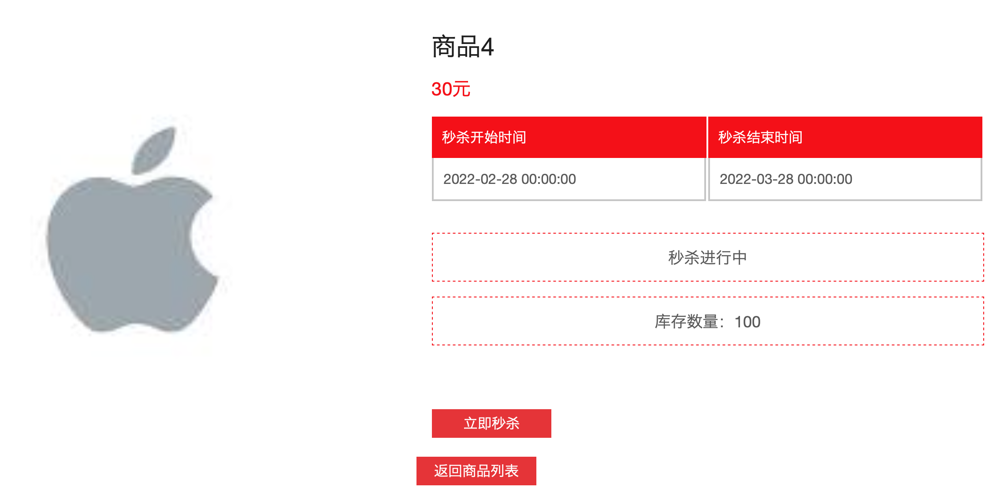
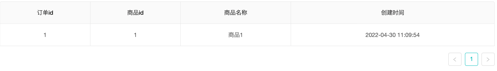

# 简介
针对前后端分离的需求，构建了用React框架的客户端前端服务器。负责前端的客户端秒杀服务器。

# 图文一览

说实话前端页面我自己做的不好看，甚至可以说很丑·····贻笑大方了。其中一些代码逻辑也是用纯粹的JS写的，没有用到脚手架，这也不算美事。

用户登陆界面（截的部分）



客户商品列表界面


客户商品详情界面




客户订单详情界面



# 如何使用
## `项目准备`
由于此项目是前后端分离，请先把后端项目跑起来。
下载前端源码后
- npm install   或者 yarn install (建议yarn方式)
下载环境依赖包
## `本地部署`
1. 修改根目录下 .env 全局文件中的变量。变量PORT是控制启动端口，与package.json文件中的启动脚本语句结合使用，可改为3000，无妨使用。.env文件中的REACT_APP_BASE_URL为请求后端微服务框架网关URL
2. 终端输入```yarn start```

## tauri start
`npm install` then `npm run build` then `npm run tauri dev`

本地运行项目，一般会自动打开游览器直接访问。

# 解决BUG
- 有时候启动时会报错babel-jest错误，看具体报错内容，去lock文件中删除与项目制定babel-jest版本不符的依赖，再删除node_modules包，再yarn install 命令重新安装。

# 参考
- [国密算法sm2、sm3和sm4的js版](https://github.com/JuneAndGreen/sm-crypto)

- [自己总结](./docs/THINK.md)
